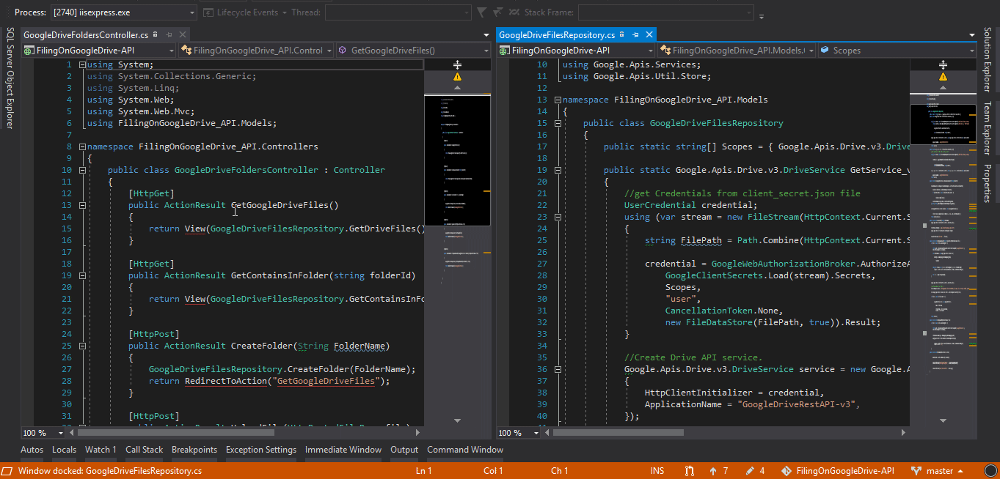

# CSharp-Module-FilingOnGoogleDrive-API ♻ 👏

## Working with Google Drive API. Create Folders and Upload files in root folder or in other custom created Folders.

This Working Module can be modified or can be placed in other Projects as per one's need.

📑💫💻

## "Just RUN & Try It Out. You Might need to Change Credentials in Project with your account to Access !" 🤟🤟🤟

Follow [This](https://www.iperiusbackup.net/en/how-to-enable-google-drive-api-and-get-client-credentials/) link to Create Your Google Drive OAuth Client Credentials. OR
Follow [This](https://everyday-be-coding.blogspot.com/p/enable-google-drive-api-v3.html) Tutorial To Properly Create & Save "Client_Secret.json"(to Store That File In Utilities Folder).

---

## Demo in Motion <u>**(Handling Google Drive On Your website)**</u>: 😉

---

## 📄 License 🔐

CSharp-Module-FilingOnGoogleDrive-API (Handling Google Drive On Your website)
Copyright (C) 2019 - Arslan Ameer

This program is free software: you can redistribute it and/or modify
it under the terms of the GNU General Public License as published by
the Free Software Foundation, either version 3 of the License, or
(at your option) any later version.

This program is distributed in the hope that it will be useful,
but WITHOUT ANY WARRANTY; without even the implied warranty of
MERCHANTABILITY or FITNESS FOR A PARTICULAR PURPOSE. See the
GNU General Public License for more details.

You should have received a copy of the GNU General Public License
along with this program. If not, see <http://www.gnu.org/licenses/>
